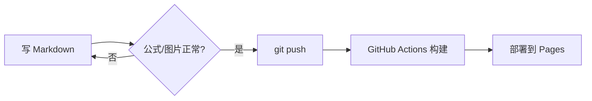

这篇讲排版：**图片与文章放同一个目录**是本站的约定，写起来跟 Word 里插图一样直接。

<!--more-->

## 图片：最省事的写法

文章是一个「目录」：`content/post/markdown-and-images/` 下有 `index.md` 和所有配图。正文里写相对路径就行：

```markdown

```

效果如下（点击可以放大）：


想引用别处的图片就直接写完整 URL：

```markdown

```

### 图片并排成图集

把多张图片**连续写在一起，中间不留空行**，主题会自动把它们排成一行（手机端自动换行）：

```markdown


```


## 表格

| 写法 | 用途 | 例子 |
| --- | --- | --- |
| `$公式$` | 行内公式 | $O(n\log n)$ |
| `` `代码` `` | 行内代码 | `hugo server` |
| `> 引用` | 引用 | 见下文 |

## 代码块

````markdown
```python {linenos=true}
def fib(n: int) -> int:
    a, b = 0, 1
    for _ in range(n):
        a, b = b, a + b
    return a
```
````

```python {linenos=true}
def fib(n: int) -> int:
    a, b = 0, 1
    for _ in range(n):
        a, b = b, a + b
    return a
```

## 提示框

用 GitHub 风格的四类提示框写「注意事项」，看笔记时很直观：

```markdown
> [!NOTE]
> 普通说明。
```

> [!NOTE]
> 普通说明。

> [!TIP]
> 一些技巧。

> [!WARNING]
> 提醒风险。

> [!CAUTION]
> 严重警告。

## 流程图（Mermaid）

主题内置 Mermaid，代码块语言写 `mermaid` 即可：



## 脚注与任务列表

这是脚注的用法[^1]，这是待办清单：

- [x] 配置主题
- [x] 写死 permalink
- [ ] 写第一篇真正的笔记

[^1]: 脚注会渲染到文章底部，适合放补充说明和参考文献链接。
