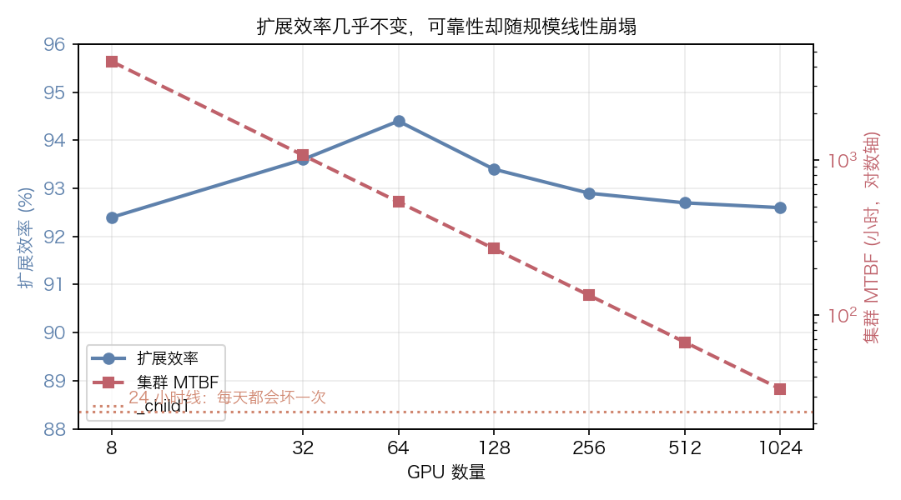
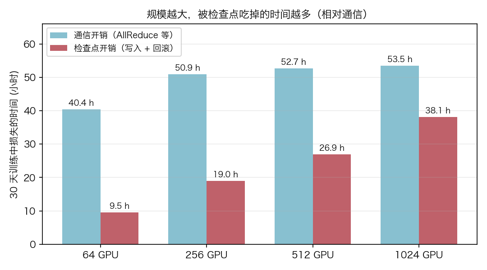

> 本文是我跟着 [MLSys·im](https://mlsysbook.ai/mlsysim/) 的教程 [Scaling to 1000 GPUs](https://mlsysbook.ai/mlsysim/tutorials/06_scaling_1000_gpus.html) 做的实验笔记与整理：模型、公式与实验数据来自该教程，行文和结论是我自己的复述与补充。

<!--more-->

## 先说结论

训练一个 70B 模型，从 8 卡扩到 1024 卡，直觉上大家最担心的都是通信：AllReduce、流水线气泡。但把数字摆出来之后，画面完全不一样：

- **扩展效率几乎没有变化**：8 卡 92.4%，1024 卡 92.6%，通信开销始终只占一小部分；
- **集群 MTBF 随规模线性崩塌**：8 卡 4285 小时，1024 卡只剩 33.5 小时——基本每天都在坏东西；
- 因果链条随之成立：**故障频繁 → 检查点更勤 → 检查点的写入 + 回滚时间在大规模下反超通信损失**。

所以规模化之后真正该问的问题不是「我的网络快不快」，而是「这套集群多久坏一次」。

## 问题设定

- **模型**：Llama-3 70B，fp16，Adam 优化器
- **硬件**：DGX H100 节点（8 卡/节点），跨节点 InfiniBand NDR（400 Gbps），节点内 NVLink
- **并行策略**：3D 并行，固定 `TP=8`（层内切分，走 NVLink）、`PP=1`（不做流水线，避免气泡干扰对比）、其余用 DP（跨节点 AllReduce 同步梯度）
- **训练时长假设**：30 天连续训练
- **单卡 MTTF**：50000 小时

两个基础模型贯穿全文。

集群级可靠性来自最朴素的并联可靠性：组件越多，整体越脆。

$$
\text{MTBF}_{\text{cluster}} \approx \frac{\text{MTTF}_{\text{GPU}}}{N}
$$

检查点的最优间隔由 **Young–Daly 公式**给出，它平衡「写检查点的开销」和「故障后回滚浪费的工作」：

$$
T_{\text{opt}} = \sqrt{2\,\delta\,M}
$$

其中 $\delta$ 是写一次检查点的时间，$M$ 是集群 MTBF。注意回滚的代价：故障发生时，上次检查点之后的工作全部作废，**平均损失半个检查点间隔**——这部分往往比写入本身更贵。

至于通信那一侧，上界由 Amdahl 定律管着：串行占比 $f$ 时，$N$ 卡的理想加速比只有 $1/(f + (1-f)/N)$。5% 的串行占比，1024 卡也只能拿到约 20×。

## 实验一：8 → 1024 卡的扩展扫描

固定 TP=8、PP=1，逐档放大集群规模，记录通信延迟与扩展效率。核心调用就一句：

```python
from mlsysim import Models, Systems
from mlsysim.solvers import DistributedModel
from mlsysim.systems.types import Fleet

model = Models.Language.Llama3_70B
fleet = Fleet(name="1024-GPU Cluster", node=Systems.Nodes.DGX_H100,
              count=128, fabric=Systems.Fabrics.InfiniBand_NDR)

r = DistributedModel().solve(model=model, fleet=fleet,
                             batch_size=1024, precision="fp16",
                             tp_size=8, pp_size=1)
```

| GPUs | Nodes | 通信 (ms) | 气泡 (ms) | 扩展效率 |
| ---: | ---: | ---: | ---: | ---: |
| 8 | 1 | 1336.8 | 0.0 | 92.4% |
| 32 | 4 | 393.4 | 0.0 | 93.6% |
| 64 | 8 | 236.2 | 0.0 | 94.4% |
| 128 | 16 | 280.4 | 0.0 | 93.4% |
| 256 | 32 | 302.4 | 0.0 | 92.9% |
| 512 | 64 | 313.5 | 0.0 | 92.7% |
| 1024 | 128 | 319.1 | 0.0 | 92.6% |

有意思的是效率曲线**在 64 卡附近最高**，之后缓慢下滑，但 1024 卡仍然保住 92.6%。8 卡那档通信延迟看起来很大（1336 ms），那是因为基线步长本身也大（算力延迟约 16.3 s），参考意义有限。

把它和可靠性曲线画在一起，反差非常直观：



如果通信是全部代价，大规模训练其实是个可以精确预测、也比较可控的工程问题。可惜它不是。

## 实验二：可靠性揭示

同样一组集群规模，换一个求解器问「多久坏一次」：

```python
from mlsysim.solvers import ReliabilityModel

r = ReliabilityModel().solve(fleet=fleet, job_duration_hours=30*24,
                            checkpoint_time_s=60.0)
print(r.fleet_mtbf.to("hour"), r.expected_failures,
      r.optimal_checkpoint_interval.to("hour"))
```

| GPUs | Nodes | 集群 MTBF | 30 天预期故障数 | Young–Daly 最优间隔 |
| ---: | ---: | ---: | ---: | ---: |
| 8 | 1 | 4285.7 h | 0.2 | 12.0 h |
| 32 | 4 | 1071.4 h | 0.7 | 6.0 h |
| 64 | 8 | 535.7 h | 1.3 | 4.2 h |
| 128 | 16 | 267.9 h | 2.7 | 3.0 h |
| 256 | 32 | 133.9 h | 5.4 | 2.1 h |
| 512 | 64 | 67.0 h | 10.8 | 1.5 h |
| 1024 | 128 | 33.5 h | 21.5 | 1.1 h |

1024 卡意味着 33.5 小时的 MTBF 和 30 天内 21.5 次故障：**平均每天坏不止一次**。为了让训练能活下来，检查点间隔必须压到 1 小时左右，于是「写检查点」从偶尔的保险动作变成了高频固定开销。

## 实验三：通信 vs 检查点，谁更贵

把两边的损失都换算成 30 天里的绝对小时数：通信损失按 `1 - 扩展效率` 折算，检查点损失 = 写入时间 + 回滚时间（故障数 × 半个间隔）。

| GPUs | 通信损失 (h) | 检查点损失 (h) | 检查点/通信 |
| ---: | ---: | ---: | ---: |
| 64 | 40.4 | 9.5 | 0.2× |
| 256 | 50.9 | 19.0 | 0.4× |
| 512 | 52.7 | 26.9 | 0.5× |
| 1024 | 53.5 | 38.1 | 0.7× |



可以看到通信损失**很快就封顶**（64 卡 40 h 到 1024 卡 53 h，增长有限），而检查点损失几乎线性上涨。也就是说，规模继续往上加，交点就在不远处——教程给的判断是：在 512 卡以上，可靠性开销会全面盖过通信开销，一个「调优良好」的任务会有 10%–30% 的墙钟时间被检查点 I/O 和回滚白白吃掉。

## 实验四：检查点为什么这么贵

因为文件实在太大了。同一套求解器换一个视角，直接算 Llama-3 70B + Adam 的状态尺寸：

```python
from mlsysim.solvers import CheckpointModel
ckpt = CheckpointModel().solve(model=model,
                               hardware=Systems.Nodes.DGX_H100.accelerator,
                               optimizer="adam", checkpoint_interval_hours=1.0)
```

| 指标 | 数值 |
| --- | --- |
| 检查点大小 | **988.4 GB** |
| 单次写入时间 | 141.2 s |
| 每小时写一次的 MFU 惩罚 | 3.92% |
| 是否受存储带宽瓶颈限制 | 是 |

合理也不合理：70B 参数在 fp16 下是 140 GB，Adam 还要存一阶、二阶动量（fp32）和主权重副本，加起来接近 1 TB 是正常的。每小时写 1 TB、还要保证能在故障后读回来——这已经不是「备份」，而是一条独立的存储流水线了。

## 我的几点体会

1. **优化网络的下限很明显，优化可靠性的上限很高。** 通信效率从 92.6% 提到 94% 大概能省 10 小时/30 天；而把 MTBF 从 33.5 小时提到 67 小时（比如减少节点内易损部件、降低单卡故障率），检查点损失能直接砍掉一半。
2. **回滚时间是被低估的那一半。** 写检查点是「确定性的预算」，回滚是「概率性的损失」。间隔太短写入变贵，间隔太长回滚变贵，Young–Daly 就是在解这个二次函数形式的权衡。
3. **PP 气泡这次被我人为关掉了。** 真实生产里 PP>1 会引入正比于 $1/PP$ 的空闲，把通信那一栏往上抬，但抬不到可靠性那一栏的高度——所以这个简化不影响结论。
4. **换到工程动作上**，大规模训练真正的抓手是：异步/分层检查点、检查点只存必要的分片、故障恢复不重跑整个 step、以及把「节点内非 GPU 部件的 MTF」也纳入容量规划。

## 参考

- 原教程：[Scaling to 1000 GPUs — MLSys·im](https://mlsysbook.ai/mlsysim/tutorials/06_scaling_1000_gpus.html)（本文的模型、公式与实验数据均来自这里）
- 前置知识：Roofline 模型与内存墙（教程 0 与 1）
- 下一步可以看同系列的「Geography is a Systems Variable」（地理位置对碳足迹的影响）和「The $9M Question」（推理成本量化）
